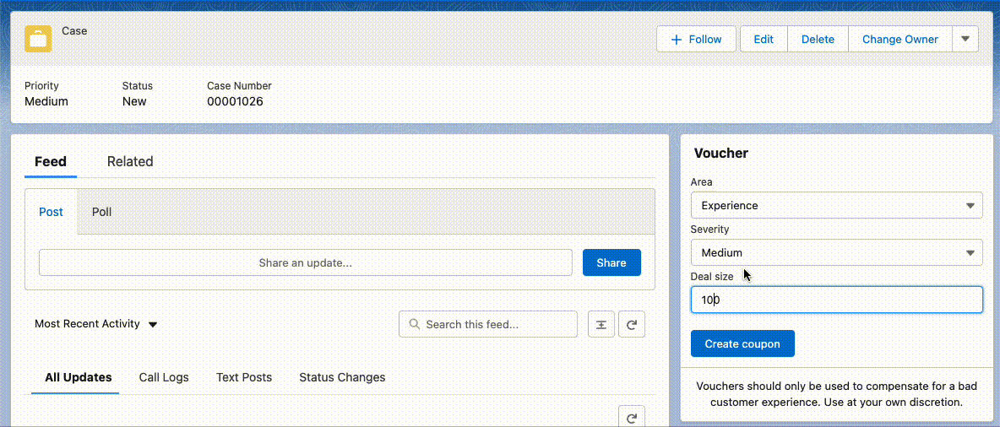

# Talon.One Coupon Generator in Salesforce

## Configuration
### Salesforce
Modify [the Remote Site settings file](force-app/main/default/remoteSiteSettings/TalonOne.remoteSite-meta.xml) to reflect your Talon.One endpoint and deploy this app, consisting of
- Custom setting "TalonVouchers"
- Apex class "TalonConnector"
- Lightning Component "TalonVoucher"

Then, in your Salesforce Org, create a custom setting defining the endpoint and the [api key](https://docs.talon.one/integration-api#section/Authentication/api_key_v1) of 

On any object, pull the Talon component into your layout and activate.

### Talon.One
Any campaign that has the coupon feature activated can be used in conjunction with this component. The component itself sends one of two custom events:
- shippingIssue
- experienceIssue

Both have attributes
- dealSize
- severity

Based on these attributes and events, a rule in a Talon.One campaign can determine which kind of coupon to generate and feed back to the customer service representative in Salesforce.